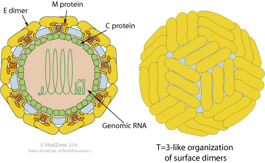

# Dengue

### Introduction

* [ViralZone: Flavivirus](http://viralzone.expasy.org/all_by_protein/24.html)
* [Wikipedia: Dengue virus](https://en.wikipedia.org/wiki/Dengue_virus)
* [Nextstrain dengue](https://nextstrain.org/dengue)

### Serology

* Fig 2 in [Katzelnick et al. 2015.](katzelnick-dengue-serology.pdf)
* Figs. 3 and 4 in [Katzelnick et al. 2017.](katzelnick-dengue-ADE.pdf)

### Timeseries

* Fig 1 in [Reich et al. 2013.](reich-dengue-timeseries.pdf)
* Fig 1 in [Recker et al. 2009.](recker-dengue-timeseries.pdf)
* Fig 1 in [Adams et al. 2006.](adams-dengue-genetics.pdf)

### Genetics

* Fig 1 in [Adams et al. 2006.](adams-dengue-genetics.pdf)
* Fig 4 in [Rasmussen et al. 2014](rasmussen-dengue-genetics.pdf)
* Fig 1 and 2 in [Pyke et al. 2016](pyke-dengue-genetics.pdf)
