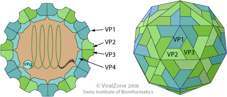

# Enterovirus

### Introduction

* [Wikipedia: Enterovirus 71](https://en.wikipedia.org/wiki/Enterovirus_71)
* [Viral Zone: Enterovirus](http://viralzone.expasy.org/all_by_species/97.html)
* [Nextstrain enterovirus D68](https://nextstrain.org/enterovirus/d68)

### Serology

* Figs 2 and 4 in [Li et al. 2013](http://journals.plos.org/plosone/article?id=10.1371/journal.pone.0080515)
* Fig 2 in [Huang et al. 2015](http://jvi.asm.org/content/89/22/11500.full)

### Timeseries

* Fig 1 in [Takahashi et al. 2016](http://journals.plos.org/plosmedicine/article?id=10.1371%2Fjournal.pmed.1001958)
* Figs 1 and 21 in [Khetsuriani et al. 2006](https://www.cdc.gov/mmwr/preview/mmwrhtml/ss5508a1.htm)
* Fig 5 in [Takahashi et al. 2018](https://royalsocietypublishing.org/doi/10.1098/rsif.2018.0507)

### Genetics

* Figs 1, 2, and 4 in [Tee et al. 2010](http://jvi.asm.org/content/84/7/3339.full)
* Figs 1 and 2 and Table 2 in [Leitch et al. 2011](http://jvi.asm.org/content/86/5/2676.full)
