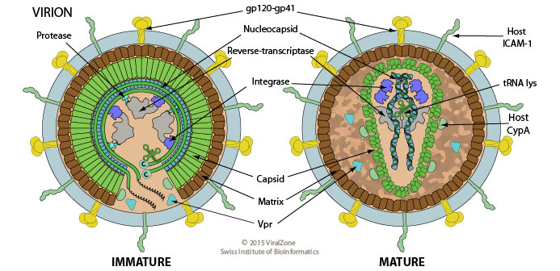

# HIV

### Introduction

* [ViralZone: HIV](http://viralzone.expasy.org/all_by_species/7.html)
* [Wikipedia: Dengue virus](https://en.wikipedia.org/wiki/HIV)

### Important features

* Within-host competition and evolution

### Serology

* Fig 1 in [Wrin et al. 1994](wrin-hiv-serology.pdf)
* Fig 2 in [Richman et al. 2003.](richman-hiv-serology.pdf)
* Fig 4 in [Nourmohammad et al. 2016.](nourmohammad-hiv-serology.pdf)
* Fig 1 in [deCamp et al. 2014.](decamp-hiv-serology.pdf)

### Timeseries

* [Canonical HIV progression curve](https://commons.wikimedia.org/wiki/File:Hiv-timecourse_copy.svg)
* Fig 3  in [Perelson and Ribeiro 2013.](perelson-hiv-timeseries.pdf)
* Fig 1 in [Di Mascio et al. 2004.](dimascio-hiv-timeseries.pdf)

### Genetics

* Fig 1 in [Shankarappa et al. 1999.](shankarappa-hiv-genetics.pdf)
* Fig 1 in [Lemey et al. 2006](lemey-hiv-genetics.pdf)
* Fig 2-8 [Zanini et al. 2015.](zanini-hiv-genetics.pdf)