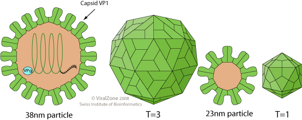

# Norovirus

### Introduction

* [ViralZone: Norovirus](http://viralzone.expasy.org/all_by_species/194.html)
* [Wikipedia: Norovirus](https://en.wikipedia.org/wiki/Norovirus)

### Serology

* Fig 9 and Table 4 in [Lopman et al. 2015](lopman-norovirus-serology.pdf)
* Fig 1 in [Sundararajan et al. 2015](sundararajan-norovirus-serology.pdf)

### Timeseries

* Fig 1 in [Lopman et al. 2008.](lopman-norovirus-timeseries.pdf)

### Genetics

* Fig 2 in [Donaldson et al. 2010](donaldson-norovirus-genetics.pdf)
* Fig 1 in [Bull et al. 2011.](bull-norovirus-genetics.pdf)
* Fig 1 and 3 in [Fioretti et al. 2014.](fioretti-norovirus-genetics.pdf)
* Fig 1 and 3 in [Tohma et al. 2017](tohma-norovirus-genetics.pdf)
