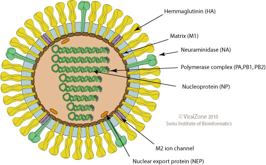

# Seasonal flu

### Introduction

* [ViralZone: Influenza A](http://viralzone.expasy.org/all_by_species/6.html)
* [Wikipedia: Seasonal Influenza](https://en.wikipedia.org/wiki/Influenza)

### Serology

* Figs 2 through 4 in [Bedford et al. 2014.](https://elifesciences.org/articles/01914)

### Timeseries

* Fig 2 in [Vijaykrishna et al. 2015.](https://elifesciences.org/articles/5055)

### Genetics

* Fig 4 in [Vijaykrishna et al. 2015.](https://elifesciences.org/articles/5055)

### Modeling

* Figs 2 and 3 in [Bedford et al. 2012.](https://bmcbiol.biomedcentral.com/articles/10.1186/1741-7007-10-38)
