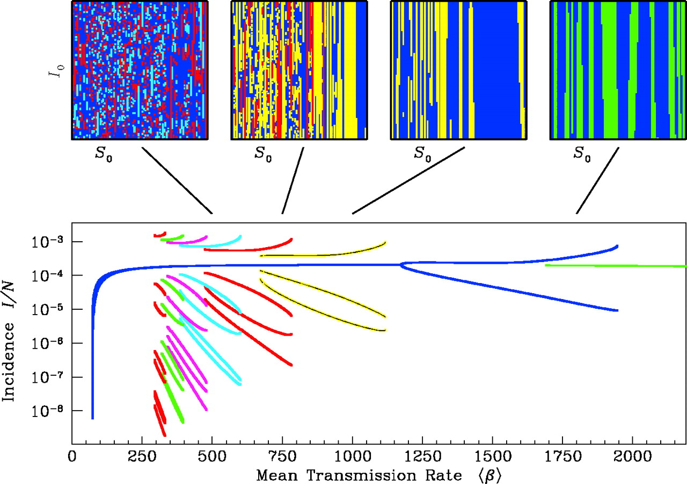

# Exercise: Modeling multiple strains

Suppose we have time series of cases caused by two strains, and we want to know if the strains interact.
To develop expectations of the possible behaviors of two strains, we build a simple, ODE-based model.
The one below has been adapted from [Keeling & Rohani (2007)](http://homepages.warwick.ac.uk/~masfz/ModelingInfectiousDiseases/Chapter4/Program_4.1/index.html).
Subscript indices refer to the status with respect to strains 1 and 2, respectively.


> (1) Draw the compartmental diagram for this model, adding parameters to the flows. Interpret each parameter. What kinds of restrictions (e.g., bounded between 0 and 1) make sense for each? Is this a history-based or status-based model?

> (2) What is the model assuming about the duration and strength of interaction? What other potential modes of interaction are missing from this model?

> (3) Consider two strains of your favorite antigenically variable pathogen. If you wanted to make a model that captures the basic dynamics of these strains, which assumptions of this model would you relax first?

> (Optional) Solve analytically for the equilibria and conditions for invasion for each strain when the other is at its endemic equilibrium.

Compare answers with your neighbors, and be sure to raise any interesting points of disagreement (or agreement or confusion) with the class.

For this next section you'll need to download a Python script. You can download it [here](https://github.com/trvrb/sismid/blob/master/models/exercise/exercise.zip?raw=true). Download this and uncompress it.

Let's assume we think this model is a pretty good starting point for testing hypotheses.
We'll numerically integrate these equations to see what they predict.
Open [`two_strain.py`](two-strain.py) and [`plot_two_strain_ts.py`](plot_two_strain_ts.py) and examine the code.
It uses the [Euler method](https://en.wikipedia.org/wiki/Euler_method) to solve the system.
The function calculates the state variables over time at `step_size` intervals.
Note that it produces estimates of the state variables over a different schedule (`t=0` to `t=end_time` at intervals of `output_interval`).
In addition to the step sizes for integration and outputs, the `two_strain` function requires parameters and initial conditions.

Run this with:

```
python plot_two_strain_ts.py
```

> (4) Modify the parameters so that the strains do not interact, and examine the resulting time series. How can you confirm that the integration is accurate?

> (5) Without allowing for interaction, see if you can adjust the parameters to obtain the following scenarios: (i) the strains have biennial, out-of-phase dynamics, and (ii) both strains are chaotic. Do you see any recurring patterns in the chaotic dynamics?

> (6) Now change `alpha` and `a` to make the strains interact. How do the dynamics differ? Do you see differences in the dynamics when you change `alpha` v. `a`?

> (Optional) Consult [the documentation](https://docs.scipy.org/doc/scipy/reference/generated/scipy.integrate.odeint.html) for SciPy's' ODE solver [`odeint`](http://docs.scipy.org/doc/scipy/reference/generated/scipy.integrate.odeint.html#scipy.integrate.odeint) in [`scipy.integrate`](http://docs.scipy.org/doc/scipy/reference/integrate.html). This solver uses an adaptive step size. See if you can implement the model using the solver--most of the content of [`two_strain.py`](two_strain.py) can be copied and pasted. Investigate the consequences of changing the tolerance limits (`rtol` and `atol`) and acceptable step sizes (`hmin` and `hmax`) of the solver. These equations are said to be [stiff](http://www.mathworks.com/company/newsletters/articles/stiff-differential-equations.html).

As you've probably discovered, SIR-type models with seasonal forcing can generate diverse patterns.
To summarize these patterns, we'll create bifurcation diagrams over several of the parameters we're interested in.
Bifurcation diagrams show the *equilibrium* behavior of a system as one parameter is varied.
These summaries are often "strobes" of the system (e.g., the number of cases every Jan. 1), but they can also show all maxima and minima over some period.
Often, for each value of the varied parameter, the system is simulated to equilibrium from different starting conditions.
This approach can reveal the presence of multiple stable states or attractors, as shown in the diagram below for a single-strain model ([Earn et al. 2001](http://www.sciencemag.org/cgi/pmidlookup?view=long&pmid=10650003)).



For simplicity, we'll create our bifurcation diagrams using the same initial conditions throughout.
We won't measure precisely whether we have obtained equilibrium conditions--we'll simply simulate for a long time, and sample the few final time points.

> (7) Carefully choose reasonable default values for all your parameters. Then create bifurcation diagrams with [`plot_two_strain_bd.py`](plot_two_strain_bd.py), independently sweeping over `alpha`, `a`, and `beta` for one strain. Be modest in creating your first diagram, and record how long it takes to run. Check your results by simulating a few time series at different points.

Run this with:

```
python plot_two_strain_bd.py
```

> (8) Is reduced transmission following infection with the heterologous strain dynamically equivalent to reduced susceptibility?

> (9) If you're starting with seasonal forcing, what happens when you remove it? Do the reverse exercise if you start without it.

You might be wondering why we should bother with all this exploration.
(Can't we just fit the darn things already?)
Fitting fails all the time, and it's important to understand why.
Simulating and summarizing dynamics are also useful tools to investigate the results from inference.

> (10) Let's say you obtained an estimate of `beta` from fitting the model. You make a bifurcation diagram, and it indicates that a 5% increase in `beta` would shift the system to chaotic dynamics. The time series don't show chaotic dynamics. What do you conclude? What if your estimate of `beta` came from experiment?
