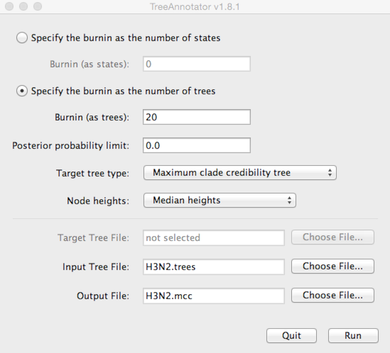
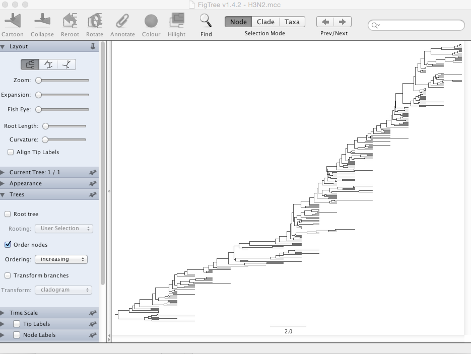
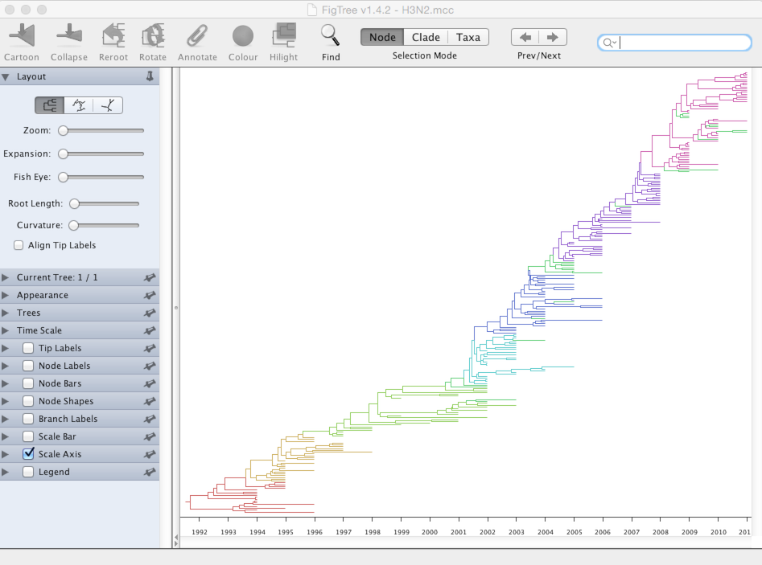

## Examine tree output

### Create MCC tree

Here, we will use FigTree to display the phylogeny from the BEAST analysis.
However, first we want to condense the posterior sample of 200 trees to something more manageable.
For this, we will use the helper program TreeAnnotator that is distributed alongside BEAST.

**Open TreeAnnotator.**

Rather frustratingly, some BEAST programs use the minimum state number as burn-in (here 1 million), while others take a count of states to throw away (here 20).
TreeAnnotator takes the latter.

**To burn-in the first 1 million states, enter `20` for 'Specify the burnin as the number of trees'.**

**Enter `H3N2.trees` as 'Input Tree File' and enter `H3N2.mcc` as 'Output file'.**

This will print out a single maximum clade credibility (MCC) tree to the file `H3N2.mcc`.
For convenience, I've included this file as `output/H3N2.mcc`.

### Visualize MCC tree

We can now open this MCC tree in FigTree.

**Open FigTree, select 'Open...' from the 'File' menu and choose the file `H3N2.mcc`.**

This displays the tree with each taxon labeled.
We can get a better idea of the structure of the phylogeny with a bit of tree manipulation.

**Turn off 'Tip Labels' in the left-hand list.**

**Under 'Trees', turn on 'Order nodes' and choose 'increasing'.**

It's clear from this analysis that contemporaneous viruses share a common ancestor just 3-5 years back.

We want to color the tree based on antigenic phenotype.

**Under 'Appearance', set 'Colour by' to 'cluster'.**

It's clear that new antigenic clusters emerge and take over the population. Next we'll look more closely at WHO vaccine strain selection.

### Next section

* [Analyze vaccine strain choice](analyze-vaccine-strain-choice.md)
