## Prepare a skyline analysis

### Load data

The program BEAST takes an XML control file that specifies sequence data, metadata and also details the analysis to be run.
All program parameters lie in this control file.
However, to make things easier, BEAST is distributed with the companion program BEAUti that assists in generating the XML.
Here, we will produce an XML that specifies a simple coalescent analysis and that infers ancestral antigenic phenotypes.

**Open BEAUti.**

This will show a window with the 'Partitions' panel open.
We first need to load the sequence data.

**Click on the '+' or choose 'Import Data...' from the File menu and select `H3N2.fasta`.**

This will load a data partition of 244 taxa and 1775 nucleotide sites.

Double-clicking the partition will open a window showing the sequence alignment.
It's good to check to make sure the alignment is in order.

### Set up evolutionary analysis

We next label each taxon with its sampling date.

**Select the 'Tips' panel, select 'Use tip dates' and click on 'Guess Dates'.**

We need to tell BEAUti where to find the tip dates in the taxon names.
Here, each taxon name ends with its date of sampling separated by a pipe.

**Select 'Defined by a prefix and its order'.**

**Select 'Order' equals 'last' and input `|` for 'Prefix'.**

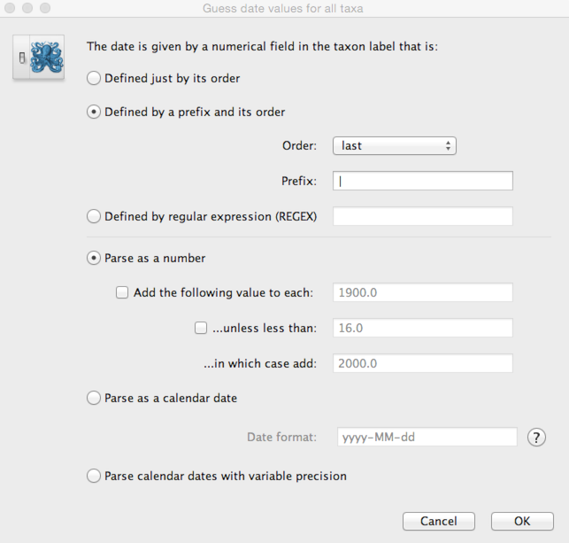

This will result in the 'Date' and 'Height' columns filing the the date forward from the past and the height of each taxon relative to the most recent taxon.

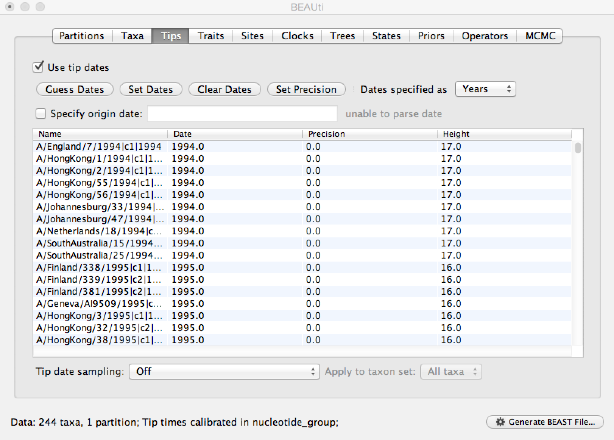

Next, we need to specify a model of the process by which nucleotide sites evolve.

**Select the 'Sites' panel.**

We default to a very simple model of evolution.
This shows that we are using an 'HKY' model to parameterize evolution between nucleotides.
This model includes a single 'kappa' parameter that specifies the rate multiplier on transitions (e.g. 'A' to 'G') vs transversions (e.g. 'A' to 'T').
We are estimating base frequencies and specifying no heterogeneity across nucleotide sites in the alignment.
Generally speaking, if internal branches on the tree are long then a more complex evolutionary model will be needed to capture the real branch lengths, while if internal branches are short, then inferences will be fairly robust to model choice.

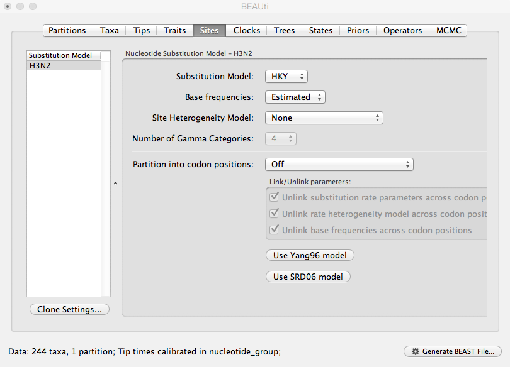

Next, we need to specify a molecular clock to convert between sequence substitutions and time.

**Select the 'Clocks' panel.**

We default to a strict molecular clock in which substitutions occur at the same rate across branches in the phylogeny.

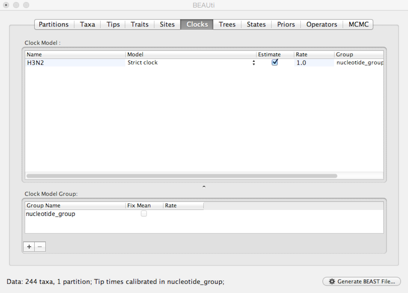

Next, we need to specify a model that describes phylogenetic structure based on some underlying demographic process.

**Select the 'Trees' panel.**

Here, we will choose a model that describes how the virus population size changes through time.
There are parametric models that assume some basic function (like exponential growth) and there are non-parametric models that don't make any strong assumptions about the pattern of change.
Here, we use a very simple constant population size coalescent model.

**Select 'Coalescent: Constant Size' from the 'Tree Prior' dropdown.**

### Set up discrete trait analysis

Here, we're going to set up inference of ancestral states of antigenic tip traits.

**Select the 'Traits' panel and click on the 'Add trait' button.**

**In the resulting dialog 'Create a new trait' named 'cluster'.**

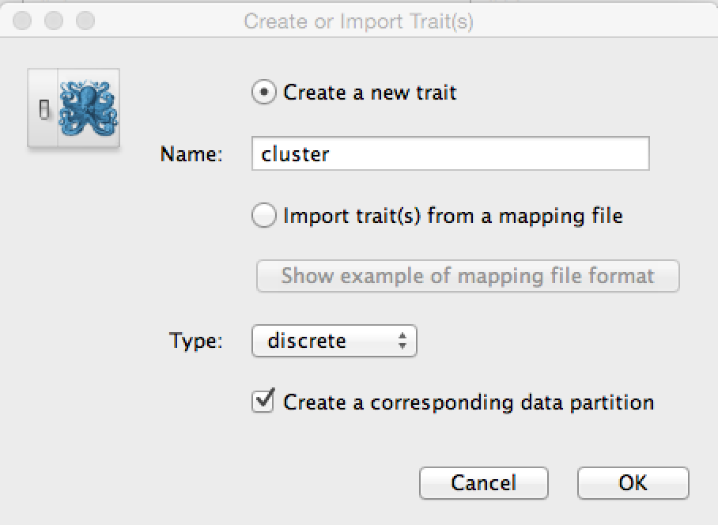

Similar to tip dates, we will import trait values from taxon names.

**Click on 'Guess trait values' and choose 'second from last' in the 'Defined by its order' dropdown.**

**Enter `|` as the delimiter.**

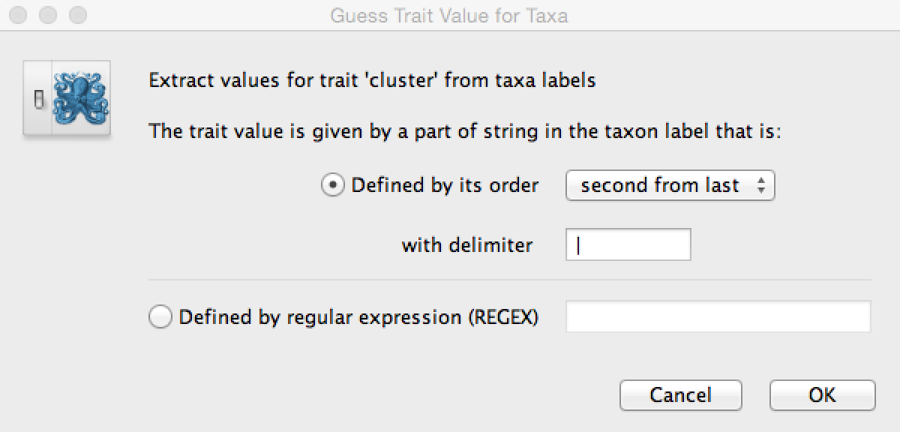

Doing so results in a discrete trait being associated with each taxon.

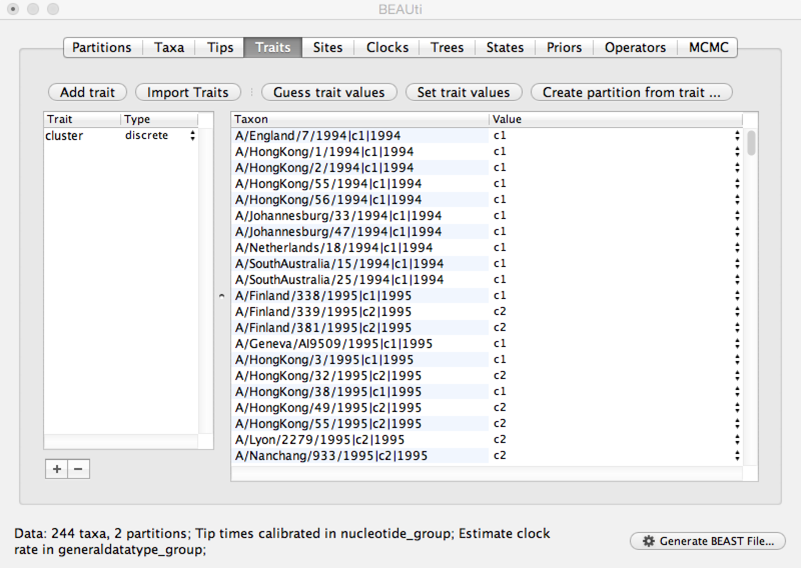

We next need to give a model for how each antigenic character state transitions to other antigenic character states.

**Select the 'Sites' panel and click on 'cluster' in the left-hand list of data partitions.**

We will use a 'Symmetric substitution model' where the rate that A goes to B equals the rate that B goes to A.
Although the asymmetric model seems like it should better match reality, using it adds significant parameter complexity and additionally sacrifices a fair degree of robustness to sampling particulars.

**Select 'Infer social network with BSSVS'.**

I have no idea why this is called "infer social network".
BSSVS stands for Bayesian Stochastic Search Variable Selection.
It adds an indicator variable for each pairwise transition rate that specifies whether the rate is on or off, i.e. at its estimated value or at 0.
These indicators serve to decrease the effective number of rate parameters that need to be estimated and are helpful to include when trying to infer a sparse transition matrix.

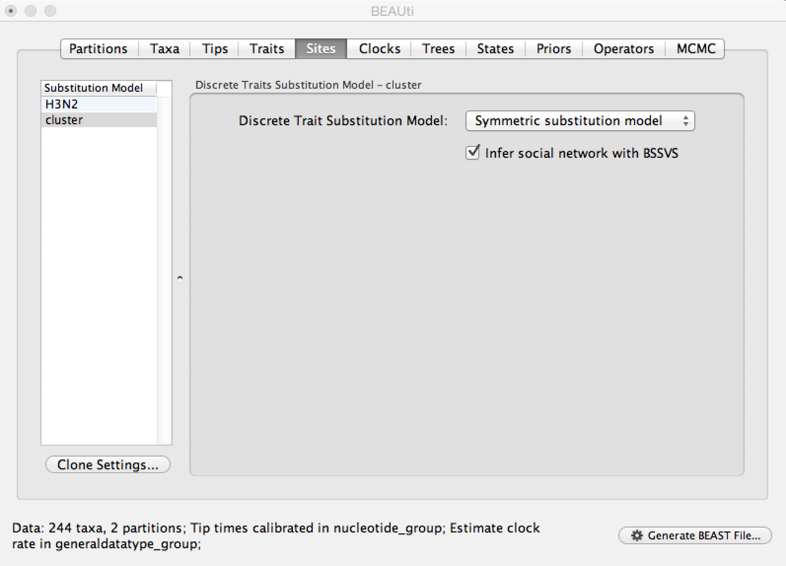

As with the sequence partition, we also need to include a model of how geographic transition rate relates to time.

**Select the 'Clocks' panel.**

We will stick with the default 'Strict clock' for transitions among antigenic clusters.

**Select the 'Trees' panel.**

We don't need to do anything here, because the sequences and the geographic locations are based on the same underlying evolutionary tree.

**Select the 'States' panel and click on 'cluster' in the left-hand list of data partitions.**

The option 'Reconstruct states at all ancestors' should already be selected. This will allow us to see when new antigenic clusters emerged.

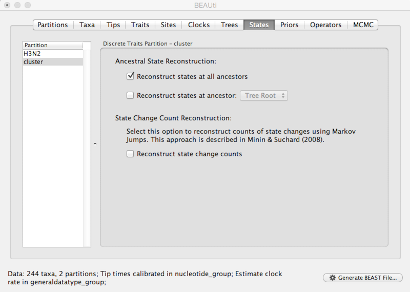

### Set up priors

Next, we need to specify priors for each parameter in the model.

**Select the 'Priors' panel.**

For the most part, BEAST has very sensible default priors.
In this case, we can leave most of the priors at their default values.

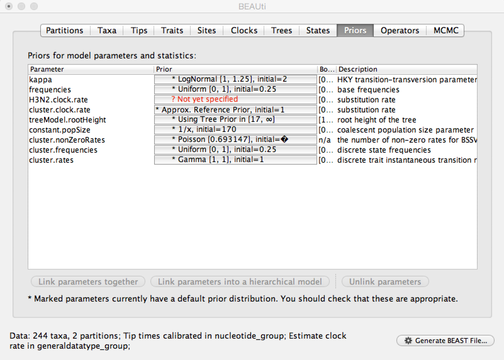

However, we are forced to choose a prior for evolutionary rate.

**Click on the prior for 'H3N2.clock.rate' (currently highlighted in red).**

The current standard prior here is the CTMC rate reference prior. This is specifically designed for evolutionary rate estimation.

**Select 'CTMC Rate Reference' from the 'Prior Distribution' dropdown.**

We actually have a good expectation from knowledge of influenza mutation rates that 'H3N2.clock.rate' should be near 0.005.
We include this as an initial value to aid convergence.

**Enter `0.005` as an 'Initial value'.**

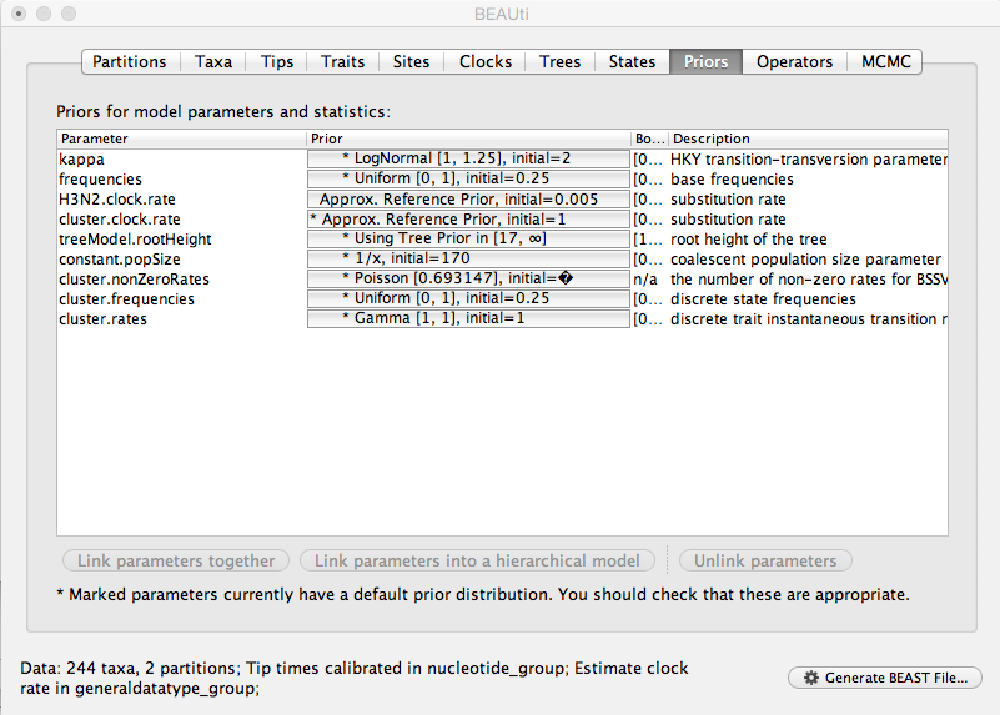

After setting this, the 'H3N2.clock.rate' prior no longer shows as red.

### Set up MCMC parameters

Next, we need to specify operators (or proposals) for the [MCMC](http://en.wikipedia.org/wiki/Markov_chain_Monte_Carlo) sampler.

**Select the 'Operators' panel.**

The exact choice of MCMC proposals will have no effect on eventual outcomes.
However, good proposals will make the MCMC more efficient and poor proposals will lead to MCMC inefficiency and longer run times.
In this case, we can stick with the default list of operators.

Next, we need to specify how often and where MCMC samples are logged to.

**Select the 'MCMC' panel.**

Generally, larger datasets will require longer chains and less frequent sampling.
I usually aim for ~1000 samples, planning to throw out the first 500 or 1000 as [burn-in](http://en.wikipedia.org/wiki/Burn-in).

**Enter `10000000` (10 million) for 'Length of chain'.**

**Enter `10000` for 'Log parameters'.**

**Enter `H3N2` for 'File name stem'.**

This will result in 1000 samples logged to the files `H3N2.log` and `H3N2.trees`.

And that's it.  We just need to save the XML control file.

**Click on 'Generate BEAST File...'**

**Select Continue when shown the priors.**

**Save the XML as `H3N2.xml`.**

I've included this XML with the practical as `xml/H3N2.xml`.

### Next section

* [Run BEAST analysis](run-beast-analysis.md)
