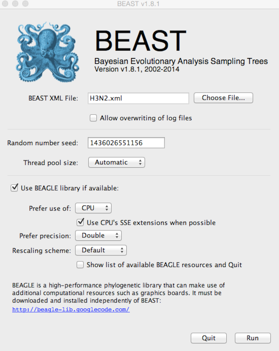

## Run BEAST analysis

This XML file contains all the information that BEAST requires.

**Open BEAST.**

**Click on 'Choose File...' and select `H3N2.xml`.**

By default, BEAST will have 'Allow overwriting of log files' turned off, so that you can't accidentally overwrite a previous run's output.
However, you'll often need to check this box when there are previous log files in the same directory that should be overwritten.

BEAGLE is turned off by default.
BEAGLE is an additional Java library that contains high-performance code to compute evolutionary likelihoods on phylogenetic trees.
Most of the BEAST analyses will work on the built-in BEAST engine.
However, some of the newer analyses will require BEAGLE.
In this case, ancestral state reconstruction requires BEAGLE to be on.

**Select 'Use BEAGLE library if available'.**

Generally, I turn on SSE as this should give a decent speed increase and set the 'Rescaling scheme' to 'Dynamic'.

**Click on 'Run'.**

This will start the BEAST run and log MCMC setup and progress to a window.
The TMRCA ('rootHeight') and the per-year substitution rate ('H3N2.clock.rate') will be logged to this window.
These two parameters often give a good idea of whether the MCMC appears to be behaving properly and help for monitoring convergence.
Additionally, the files `H3N2.log` and `H3N2.trees` will start to fill with MCMC samples.

Unfortunately, BEAST runs can take quite a long time, and it's not always clear how long they need to run.
Because of these time requirements, I almost never run BEAST analyses locally, preferring instead to get the XML up and running and tested locally and then running BEAST on a cluster node to perform the full analysis.
In this case, it took a single cluster node 2.5 hours to compute the 10 million MCMC steps, resulting in 1001 samples being logged and a 48 MB trees file.

I've included the resulting log file and trees file in the practical as `output/H3N2.log` and `output/H3N2.trees`.

### Next section

* [Examine MCMC output](examine-mcmc-output.md)
