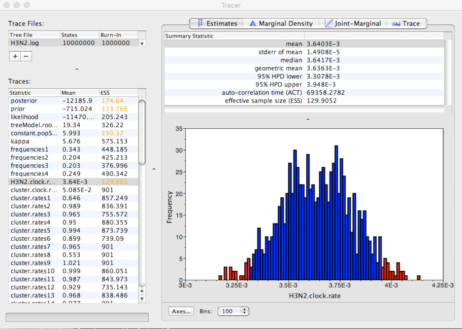

## Examine MCMC output

Here, we begin by looking at estimated parameter values from the BEAST analysis.

**Open Tracer.**

Tracer is designed to take a tab-delimited file in which each line represents a separate MCMC sample.

**Click '+' and select 'H3N2.log' from the resulting dialog.**

This displays each parameter as a separate element in the 'Traces' list.
First off, we need to assess whether the MCMC has converged to its stationary distribution.
The simplest way to do this is to look at MCMC state through time.

**Select 'posterior' from the list of 'Traces' and select the 'Trace' panel on the right.**

This shows the posterior log probability of the model given the data for each step in the MCMC chain.

The MCMC chain starts out in a poor configuration, but eventually converges on the correct stationary distribution.
Because of this, the initial steps in the MCMC need to be discarded as burn-in.
Here, it looks like the default 10% or 1 million steps may be okay.

It's good to check other parameters to confirm that their values appear to have burnt-in as well.
There are more rigorous ways to assess burn-in, but we will stick with this simple eye-ball-the-trace method for the practical.

After burn-in each sample from the MCMC represents a sample from the posterior distribution of model parameters given the data.
For instance, we can look at estimates of substitution rate across the MCMC

**Select 'H3N2.clock.rate' from the list of 'Traces' and select the 'Estimates' panel on the right.**

This shows the distribution of posterior values of clock rate.
The mean estimate is 0.00364 substitutions per site per year.
However, other estimates are also consistent with the data.
The 95% credible interval lies between 0.00331 and 0.00395 subs per site per year.

Because [autocorrelation](http://en.wikipedia.org/wiki/Autocorrelation) exists between samples in the MCMC chain, our estimates of means and credible intervals have more variance than would be expected from 900 independent samples.
This inflation of variance can be estimated based on the effective sample size (ESS), which gives the number of independent samples that would give the same variance as the observed autocorrelated samples.

In this case, we can see that some parameters have very little autocorrelation, for instance, kappa with an ESS of 575.
However, clock rate has substantial autocorrelation (it's difficult to adjust clock rate without adjusting parameters in the MCMC), giving it an ESS of 130.

The error in the estimate of a mean is equal to the sample standard deviation divided by the square root of the sample size.
In this case, Tracer gives the standard error of the mean estimate of clock rate as 1.5 &times; 10-5.

A rate of evolution of ~0.0036 subs per site per year is reasonable for an RNA virus. With ~1000 sites in HA1, we expect 3-4 mutations per year along a branch of the phylogeny.

We are also interested in coalescent rate and *Ne&tau;*.

**Select 'constant.popSize' from the list of 'Traces' and select the 'Estimates' panel on the right.**

Here, we see that the mean estimate of *Ne&tau;* is 5.99 years with a 95% credible interval that lies between 4.98 and 7.01 years.

This is expected waiting time for two random lineages in the population to coalesce. If we assume a duration of infection of 5 days, then *&tau;* = 0.014 years per generation. Thus, we estimate *Ne* to equal ~428 generations. This indicates that H3N2 shows extremely rapid coalescence. We believe this rapid coalescence occurs through repeated selective sweeps of novel antigenic variants, something we'll investigate further in the next section.

### Next section

* [Examine tree output](figtree.md)
