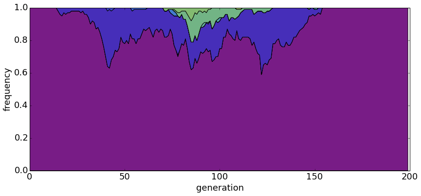
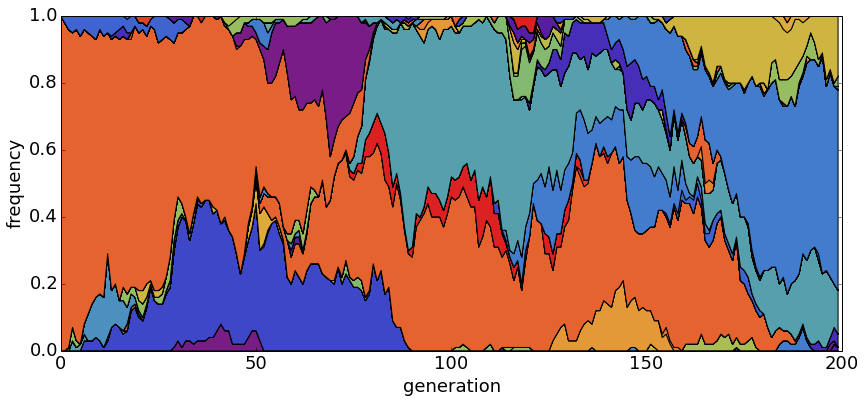
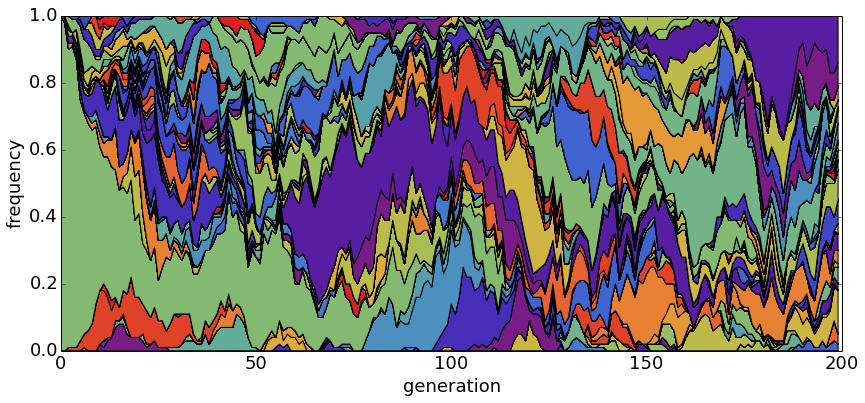

# Summary statistics of neutral population models

This is all assuming a Wright-Fisher population of discrete non-overlapping generations.

## Parameters

* There are a fixed number of *N* individuals.

* Mutations enter the population at a rate of *&mu;* mutations per individual per site per generation.

* In a haploid population (usually the case for pathogens), we summarize the population with the parameter *&theta;*, which equals 2*N&mu;*. Without temporally resolved data, it's not possible to separately estimate *N* and *&mu;*; in most population genetic circumstances, we can only estimate *&theta;*. With temporally resolved data we can separate *&theta;* into *N* and *&mu;*.

## Diversity

Genetic diversity is most commonly summarized with the statistic *&pi;*, which is equal to the average number of mutations per site between two random individuals in the population. *&pi;* is most commonly measured in terms of substitutions per site. The expectation of *&pi;* follows

`$$ E[\pi] = \theta = 2N\mu $$`.

*&pi;* for *Drosophila* and *&pi;* for flu is approximately 0.01, while *&pi;* for humans is approximately 0.001. This means that for an average length gene of 1000 basepairs, two random fruit flies or two random flues will probably differ at ~10 sites, while two random humans will differ at ~1 site.

With *&theta;* = 0.2, there is usually only a single dominant haplotype in the population.

With *&theta;* = 1.0, there are generally a small handful of haplotypes.

With *&theta;* = 5.0, there are many segregating haplotypes.

## Chance of fixation

A new mutant appears in the population at an initial frequency *p* of `$1/N$`. It has a 

If a mutant is at population frequency *p*, then it has a *p* chance of fixing.
